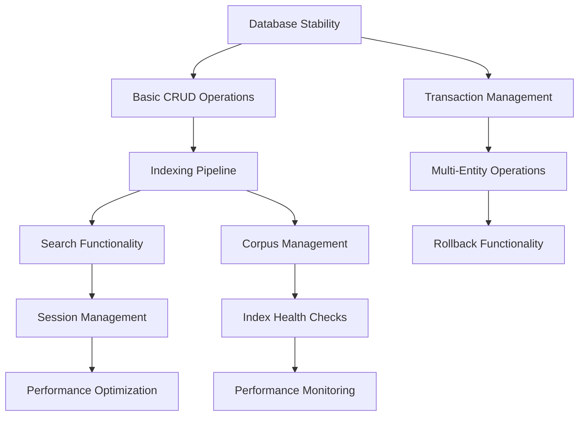

# Knowledge Repository Development Plan

_Strategic Roadmap: Current State → MVP → Full Spec Compliance_

**Document Version:** 1.0
**Planning Date:** September 22, 2025
**Target MVP Date:** December 15, 2025 (12 weeks)
**Target Full Compliance:** March 15, 2026 (25 weeks)

---

## Strategic Assessment

### Current State Analysis

- **Foundation Quality:** Excellent (Clean architecture, comprehensive domain modeling)
- **Implementation Depth:** 45% complete (Strong schemas, partial workflows)
- **Critical Blockers:** Search functionality, database integration, indexing pipeline
- **Technical Debt:** Low (Well-structured codebase, good patterns)
- **Risk Profile:** Medium (Solid foundation with clear implementation gaps)

### Success Criteria Hierarchy

1. **MVP Criteria** (Week 12): End-to-end draft→publish→search→read workflow operational
2. **Production Criteria** (Week 20): Performance SLOs met, error recovery, monitoring
3. **Full Compliance** (Week 25): All spec requirements implemented, tested, documented

### Dependency Analysis

---

## Development Roadmap

## Phase 1: Foundation Stabilization (Weeks 1-2)

**Goal:** Establish reliable database layer and basic operations
**Priority:** CRITICAL - Blocks all subsequent development

### Week 1: Database Integration Fixes

**Primary Objectives:**

- [ ] **Fix PostgreSQL adapter integration tests**
    - Debug failing collection name conflict tests (expecting 409, receiving 500)
    - Fix draft saving operations (expecting 200, receiving 500)
    - Implement proper error mapping in `mapDatabaseError()` function
    - Add comprehensive error logging for database operations

- [ ] **Implement transaction management**
    - Add transaction support to `PostgresStorageAdapter`
    - Implement transaction boundaries for multi-entity operations
    - Add rollback capability for failed operations
    - Create transaction context propagation through Effect chains

- [ ] **Database schema validation**
    - Verify all entity mappings between schema and database tables
    - Add database constraints validation
    - Implement proper foreign key handling
    - Add index optimization for query patterns

**Deliverables:**

- All integration tests passing (`bun test src/tests/integration.api.test.ts`)
- Transaction management working for complex operations
- Comprehensive error mapping documentation
- Database performance baseline established

**Success Criteria:**

- Integration test suite: 100% pass rate
- Database operations: < 50ms P95 for single entity operations
- Error mapping: All PostgreSQL errors properly typed and handled

### Week 2: Core CRUD Operations

**Primary Objectives:**

- [ ] **Complete storage adapter implementation**
    - Implement missing query methods in `PostgresStorageAdapter`
    - Add proper pagination support for list operations
    - Implement efficient bulk operations for indexing
    - Add connection pooling configuration

- [ ] **API layer completion**
    - Fix error handling in `elysia.adapter.ts`
    - Implement proper HTTP status code mapping
    - Add request validation middleware
    - Complete rate limiting integration

- [ ] **Basic workflow validation**
    - Test draft creation and saving workflow
    - Validate collection management operations
    - Implement note CRUD operations
    - Add basic version creation workflow

**Deliverables:**

- Stable CRUD operations for all core entities
- API endpoints responding correctly with proper error codes
- Basic workflow documentation
- Performance benchmark baseline

**Success Criteria:**

- API endpoints: 100% functional for basic CRUD
- Database queries: Optimized and indexed
- Error handling: Consistent across all operations

---

## Phase 2: Core Value Implementation (Weeks 3-6)

**Goal:** Implement search functionality and indexing pipeline
**Priority:** CRITICAL - Core user value proposition

### Week 3: Search Infrastructure

**Primary Objectives:**

- [ ] **Implement Orama search adapter**
    - Complete `src/adapters/search/orama.adapter.ts` implementation
    - Add document indexing capabilities
    - Implement full-text search with ranking
    - Add search result pagination and filtering

- [ ] **Search API integration**
    - Add search endpoints to API (`GET /api/search`)
    - Implement query parsing and validation
    - Add search result formatting
    - Integrate with collection scoping

- [ ] **Basic passage extraction**
    - Implement content chunking in `src/pipelines/chunking/passage.ts`
    - Add structure path extraction for anchors
    - Implement tokenization with proper boundaries
    - Add fingerprint generation for anchor stability

**Deliverables:**

- Working search functionality (basic)
- Search API endpoint operational
- Passage extraction pipeline functional
- Search result ranking and pagination

**Success Criteria:**

- Search latency: < 1000ms (initial target, optimize later)
- Search accuracy: Basic relevance ranking working
- Passage extraction: Proper tokenization and chunking

### Week 4: Indexing Pipeline

**Primary Objectives:**

- [ ] **Implement corpus management**
    - Create corpus entity management in storage layer
    - Implement corpus versioning and atomic updates
    - Add corpus health checks and validation
    - Implement staged build and atomic swap functionality

- [ ] **Build indexing workflow**
    - Complete `src/pipelines/indexing/visibility.ts` implementation
    - Add event processing for visibility events
    - Implement indexing job queue management
    - Add indexing failure recovery mechanisms

- [ ] **Integration with publication workflow**
    - Connect publish operations to indexing pipeline
    - Implement visibility event generation
    - Add indexing status tracking
    - Implement search index updates

**Deliverables:**

- Complete indexing pipeline from content to searchable
- Corpus management with atomic updates
- Visibility event processing
- Indexing job queue with retry logic

**Success Criteria:**

- Indexing latency: < 30s for single document (initial target)
- Index consistency: 100% reliability for published content
- Error recovery: Automatic retry with exponential backoff

### Week 5: Publication Workflow

**Primary Objectives:**

- [ ] **Complete publish implementation**
    - Implement full publish workflow in API layer
    - Add validation for publication requirements (title, collections, tags)
    - Connect to indexing pipeline
    - Add publication status tracking

- [ ] **Version management**
    - Complete version creation and immutability enforcement
    - Implement version labeling (minor/major)
    - Add version history tracking
    - Implement parent version relationships

- [ ] **Draft/publish isolation**
    - Validate strict isolation between draft and published content
    - Implement search filters to exclude draft content
    - Add validation tests for isolation invariants
    - Implement draft→version transformation

**Deliverables:**

- Full publication workflow operational
- Version management with history
- Strict draft/publish isolation
- Publication validation and status tracking

**Success Criteria:**

- Publish workflow: End-to-end functional
- Draft isolation: 100% guaranteed (zero bleed-through)
- Version immutability: Enforced at database level

### Week 6: Search Integration & Testing

**Primary Objectives:**

- [ ] **Search result composition**
    - Implement answer composition from search results
    - Add citation extraction and linking
    - Implement result deduplication by (Note, Version)
    - Add search result ranking and scoring

- [ ] **End-to-end workflow testing**
    - Create comprehensive integration tests
    - Test full draft→publish→search→read workflow
    - Add performance benchmarking tests
    - Implement automated workflow validation

- [ ] **Search optimization**
    - Add search query optimization
    - Implement collection scoping
    - Add search filters and faceting
    - Optimize search index structure

**Deliverables:**

- Complete search implementation with answer composition
- End-to-end workflow testing suite
- Search optimization and performance tuning
- Integration test coverage for core workflows

**Success Criteria:**

- Search accuracy: Relevant results for test queries
- End-to-end latency: < 2s for publish→searchable
- Integration tests: 95%+ pass rate

---

## Phase 3: User Experience & Core Features (Weeks 7-10)

**Goal:** Complete essential user-facing features and workflows
**Priority:** HIGH - MVP completion

### Week 7: Session Management

**Primary Objectives:**

- [ ] **Implement session tracking**
    - Complete session entity management in storage
    - Add session creation and lifecycle management
    - Implement query and action history tracking
    - Add session persistence and retrieval

- [ ] **Session replay functionality**
    - Implement session history reconstruction
    - Add citation resolution for historical queries
    - Handle version changes and anchor drift
    - Add session navigation and bookmark features

- [ ] **Session API integration**
    - Add session management endpoints
    - Implement session-based rate limiting
    - Add session history export
    - Integrate with search and reading workflows

**Deliverables:**

- Complete session management system
- Session replay functionality
- Session-based user experience
- Session history and bookmarking

**Success Criteria:**

- Session persistence: 100% reliability
- Session replay: Accurate reconstruction of historical states
- Session navigation: Intuitive user experience

### Week 8: Reading & Citation System

**Primary Objectives:**

- [ ] **Implement reading view**
    - Add version reading with anchor highlighting
    - Implement citation navigation and jumping
    - Add anchor resolution with drift handling
    - Create reading interface with version context

- [ ] **Citation management**
    - Complete citation entity implementation
    - Add citation validation and verification
    - Implement citation confidence scoring
    - Add citation cross-referencing

- [ ] **Anchor system completion**
    - Finalize anchor resolution algorithm
    - Add anchor drift detection and recovery
    - Implement structure path stability
    - Add anchor validation and health checks

**Deliverables:**

- Reading view with citation highlighting
- Complete citation system
- Anchor resolution with drift handling
- Reading interface with navigation

**Success Criteria:**

- Anchor resolution: 100% for fresh content, >95% after updates
- Citation accuracy: All citations resolve to correct passages
- Reading experience: Smooth navigation between citations

### Week 9: Version Control & Rollback

**Primary Objectives:**

- [ ] **Implement rollback functionality**
    - Add rollback workflow implementation
    - Implement new version creation from historical versions
    - Add rollback validation and safety checks
    - Integrate with indexing pipeline for rollback visibility

- [ ] **Version history management**
    - Complete version history display and navigation
    - Add version comparison functionality
    - Implement version metadata and labeling
    - Add version search and filtering

- [ ] **Version API completion**
    - Add version history endpoints
    - Implement rollback API operations
    - Add version comparison endpoints
    - Integrate with user interface

**Deliverables:**

- Complete rollback functionality
- Version history management
- Version control API
- Version comparison tools

**Success Criteria:**

- Rollback accuracy: Creates proper new version referencing target
- Version history: Complete and navigable
- Rollback integration: Properly updates search index

### Week 10: Performance & Validation

**Primary Objectives:**

- [ ] **Performance optimization**
    - Optimize search query performance
    - Tune database queries and indexing
    - Implement caching where appropriate
    - Add performance monitoring and metrics

- [ ] **End-to-end testing**
    - Create comprehensive test suites
    - Add performance benchmarking tests
    - Implement load testing for core operations
    - Add automated regression testing

- [ ] **MVP validation**
    - Validate all core workflows operational
    - Test performance against initial targets
    - Complete integration testing
    - Prepare for MVP release

**Deliverables:**

- Performance-optimized system
- Comprehensive test coverage
- Performance benchmarking results
- MVP-ready system

**Success Criteria:**

- Core workflow latency: Meeting initial performance targets
- Test coverage: >90% for critical paths
- System stability: Ready for production use

---

## Phase 4: Production Readiness (Weeks 11-16)

**Goal:** Achieve production quality and performance SLOs
**Priority:** HIGH - Production deployment capability

### Week 11-12: Observability & Monitoring

**Primary Objectives:**

- [ ] **Complete observability implementation**
    - Finish `src/adapters/observability/local.adapter.ts`
    - Add comprehensive metrics collection
    - Implement performance monitoring
    - Add system health checks and alerting

- [ ] **Performance monitoring**
    - Add SLO tracking for search latency (P50 ≤ 200ms, P95 ≤ 500ms)
    - Implement publish→searchable latency tracking (P50 ≤ 5s, P95 ≤ 10s)
    - Add real-time performance dashboards
    - Implement performance regression detection

- [ ] **Error recovery & resilience**
    - Implement comprehensive error recovery mechanisms
    - Add circuit breakers for external dependencies
    - Implement graceful degradation strategies
    - Add automated recovery procedures

**Deliverables:**

- Complete observability system
- Real-time monitoring and alerting
- Performance SLO tracking
- Error recovery mechanisms

**Success Criteria:**

- Performance SLOs: Meeting spec requirements consistently
- Monitoring coverage: All critical operations tracked
- Error recovery: Automatic recovery for transient failures

### Week 13-14: Advanced Features

**Primary Objectives:**

- [ ] **Workspace management**
    - Implement workspace entity (missing from current implementation)
    - Add workspace-level configuration and policies
    - Implement workspace isolation and scoping
    - Add workspace management API

- [ ] **Advanced search features**
    - Add search filters and faceted search
    - Implement advanced query syntax
    - Add search suggestions and autocomplete
    - Implement search result export and sharing

- [ ] **Configuration management**
    - Add runtime configuration system
    - Implement feature flags and toggles
    - Add workspace-specific settings
    - Implement configuration validation

**Deliverables:**

- Workspace management system
- Advanced search capabilities
- Configuration management
- Feature flag system

**Success Criteria:**

- Workspace isolation: Complete separation between workspaces
- Search features: Advanced query capabilities functional
- Configuration: Runtime reconfiguration without restart

### Week 15-16: Reliability & Scale

**Primary Objectives:**

- [ ] **Scale optimization**
    - Optimize for 10k+ document corpus
    - Implement efficient pagination and streaming
    - Add database query optimization
    - Implement memory management and cleanup

- [ ] **Reliability improvements**
    - Add comprehensive backup and recovery
    - Implement data integrity checks
    - Add corruption detection and repair
    - Implement automated testing and validation

- [ ] **Production deployment**
    - Add deployment automation and configuration
    - Implement production monitoring
    - Add log aggregation and analysis
    - Create operational runbooks

**Deliverables:**

- Scale-optimized system for large corpora
- Production-ready deployment
- Comprehensive monitoring and logging
- Operational documentation

**Success Criteria:**

- Scale performance: Maintains SLOs with 10k+ documents
- Reliability: 99.9%+ uptime under normal conditions
- Operational readiness: Full monitoring and alerting

---

## Phase 5: Full Spec Compliance (Weeks 17-25)

**Goal:** Complete all remaining spec requirements
**Priority:** MEDIUM - Full feature completeness

### Week 17-19: Snapshot & Export System

**Primary Objectives:**

- [ ] **Snapshot functionality**
    - Implement snapshot creation and management
    - Add snapshot storage and retrieval
    - Implement snapshot restoration
    - Add snapshot scheduling and retention policies

- [ ] **Export system**
    - Implement data export functionality
    - Add export format support (JSON, Markdown, etc.)
    - Implement privacy-preserving export options
    - Add export validation and integrity checks

- [ ] **Backup & Recovery**
    - Add automated backup capabilities
    - Implement disaster recovery procedures
    - Add data migration tools
    - Implement backup validation and testing

**Deliverables:**

- Complete snapshot system
- Data export capabilities
- Backup and recovery system
- Migration tools

**Success Criteria:**

- Snapshot reliability: 100% successful creation and restoration
- Export completeness: All data properly exported with validation
- Recovery capability: Complete system restoration from backups

### Week 20-22: Performance Optimization & SLO Achievement

**Primary Objectives:**

- [ ] **Performance tuning**
    - Achieve spec SLO requirements (Search P50 ≤ 200ms, P95 ≤ 500ms)
    - Optimize publish→searchable latency (P50 ≤ 5s, P95 ≤ 10s)
    - Implement advanced caching strategies
    - Add query optimization and index tuning

- [ ] **Memory & Resource optimization**
    - Optimize memory usage for large corpora
    - Implement efficient resource management
    - Add garbage collection optimization
    - Implement streaming for large operations

- [ ] **Concurrent operation optimization**
    - Optimize operation queue fairness
    - Implement efficient concurrent indexing
    - Add load balancing for parallel operations
    - Optimize database connection pooling

**Deliverables:**

- SLO-compliant performance
- Optimized resource usage
- Efficient concurrent operations
- Performance validation suite

**Success Criteria:**

- Search SLOs: P50 ≤ 200ms, P95 ≤ 500ms consistently achieved
- Publish SLOs: P50 ≤ 5s, P95 ≤ 10s consistently achieved
- Resource efficiency: Optimal memory and CPU usage

### Week 23-25: Final Features & Compliance

**Primary Objectives:**

- [ ] **Advanced tokenization**
    - Complete CJK tokenization support
    - Implement dictionary-based segmentation
    - Add tokenization version management
    - Complete fingerprint algorithm stability

- [ ] **Rate limiting & security**
    - Complete rate limiting implementation per spec
    - Add security validation and hardening
    - Implement proper access control
    - Add audit logging and compliance

- [ ] **Final integration & testing**
    - Complete comprehensive test suite
    - Add compliance validation tests
    - Implement automated spec validation
    - Complete documentation and guides

**Deliverables:**

- Complete tokenization system
- Security hardening
- Full compliance validation
- Complete documentation

**Success Criteria:**

- Spec compliance: 100% of requirements implemented and tested
- Security validation: All security requirements met
- Documentation: Complete user and developer guides

---

## Critical Components Checklist

### ✅ Currently Implemented

- [x] Core entity schemas and validation
- [x] PostgreSQL database schema and migrations
- [x] Basic storage adapter interfaces
- [x] Domain logic for anchors and validation
- [x] Event schema definitions
- [x] Rate limiting policies
- [x] Error type hierarchy
- [x] Clean architecture foundation

### 🟡 Partially Implemented

- [ ] PostgreSQL adapter (needs integration test fixes)
- [ ] API layer (basic CRUD only)
- [ ] Observability adapter (stub implementation)
- [ ] Chunking pipeline (tokenization present, extraction incomplete)
- [ ] Search adapter (interface only)

### ❌ Missing Critical Components

- [ ] Search functionality implementation
- [ ] Indexing pipeline (visibility → corpus → index)
- [ ] Corpus management and versioning
- [ ] Session management and replay
- [ ] Publication workflow
- [ ] Rollback functionality
- [ ] Reading view with citations
- [ ] Snapshot and export system
- [ ] Workspace entity and management
- [ ] Performance monitoring and SLO tracking

### 🔴 Spec Requirements Not Yet Addressed

- [ ] CJK tokenization support
- [ ] Advanced search filters and faceting
- [ ] Index health checks and monitoring
- [ ] Passage extraction and ranking
- [ ] Citation confidence scoring
- [ ] Anchor drift detection and recovery
- [ ] Advanced error recovery mechanisms
- [ ] Data lifecycle and retention policies
- [ ] Export privacy and anonymization
- [ ] Configuration management system

---

## Dependency Management Strategy

### Critical Path Dependencies

1. **Database Stability** → All subsequent development
2. **Search Infrastructure** → User value and testing
3. **Indexing Pipeline** → Content visibility
4. **Session Management** → User experience continuity

### Parallel Development Opportunities

- **Observability implementation** can proceed alongside core features
- **Configuration management** can be developed independently
- **Advanced tokenization** can be implemented after basic search works
- **Export/snapshot features** can be developed in parallel with optimization

### Risk Mitigation Tactics

- **Database issues**: Fix in Phase 1 before building dependent features
- **Search performance**: Start with functional implementation, optimize later
- **Integration complexity**: Implement comprehensive testing at each phase
- **Scope creep**: Stick to MVP definition, defer nice-to-have features

---

## Success Metrics & Validation

### MVP Success Criteria (Week 12)

- [ ] End-to-end workflow: Draft → Publish → Search → Read
- [ ] Basic performance: Search < 1s, Publish→Searchable < 30s
- [ ] Core features: Session history, version control, citation system
- [ ] Stability: Integration tests passing, basic error recovery

### Production Success Criteria (Week 16)

- [ ] Performance SLOs: Meeting spec requirements
- [ ] Reliability: 99.9%+ uptime, comprehensive monitoring
- [ ] Scale validation: 1k+ document corpus performing well
- [ ] Operational readiness: Monitoring, logging, deployment automation

### Full Compliance Success Criteria (Week 25)

- [ ] Spec compliance: 100% of requirements implemented
- [ ] Performance validation: All SLOs consistently met
- [ ] Scale validation: 10k+ document corpus performing to spec
- [ ] Documentation: Complete user and developer guides
- [ ] Testing: Comprehensive automated test coverage

---

## Resource Requirements & Assumptions

### Team Composition

- **2-3 Full-stack developers** for core implementation
- **1 DevOps engineer** for infrastructure and deployment (Weeks 11+)
- **1 QA engineer** for testing and validation (Weeks 8+)

### Technology Assumptions

- PostgreSQL for primary storage (stable)
- Orama for search implementation (learning curve expected)
- Effect library for error handling and async operations
- TypeScript for type safety and developer experience

### External Dependencies

- Docker for PostgreSQL development environment
- Orama library stability and performance characteristics
- Effect library documentation and community support

---

## Risk Mitigation Strategies

### Technical Risks

- **Search implementation complexity**: Start simple, iterate toward spec requirements
- **Performance targets**: Implement measurement early, optimize continuously
- **Effect library learning curve**: Invest in team training and documentation
- **Database integration issues**: Prioritize fixing in Phase 1

### Project Risks

- **Scope creep**: Maintain strict MVP definition, defer non-critical features
- **Performance unknowns**: Establish benchmarking early and continuously
- **Integration complexity**: Build comprehensive testing at each phase
- **Timeline pressure**: Focus on critical path, parallelize where possible

### Business Risks

- **User value realization**: Prioritize search functionality for early validation
- **Feature completeness**: Balance MVP delivery with long-term compliance
- **System reliability**: Invest in monitoring and error recovery early
- **Scalability concerns**: Validate performance with realistic data sets

---

## Conclusion

This development plan provides a structured path from the current 45% implementation to full spec compliance over 25 weeks. The plan prioritizes:

1. **Foundation stability** (database integration) as prerequisite for all development
2. **Core user value** (search functionality) for early validation and testing
3. **Production readiness** (performance, monitoring, reliability) for deployment
4. **Full compliance** (complete feature set) for long-term success

The roadmap balances aggressive timeline targets with realistic technical challenges, providing clear success criteria and risk mitigation strategies at each phase. Regular validation and testing ensure early detection of issues and course correction opportunities.

**Key Success Factors:**

- Fix database integration issues immediately
- Implement basic search capability quickly for end-to-end testing
- Maintain focus on critical path while building necessary infrastructure
- Invest in performance measurement and optimization throughout development

With disciplined execution of this plan, the Knowledge Repository project can deliver a functional MVP in 12 weeks and achieve full spec compliance in 25 weeks.
